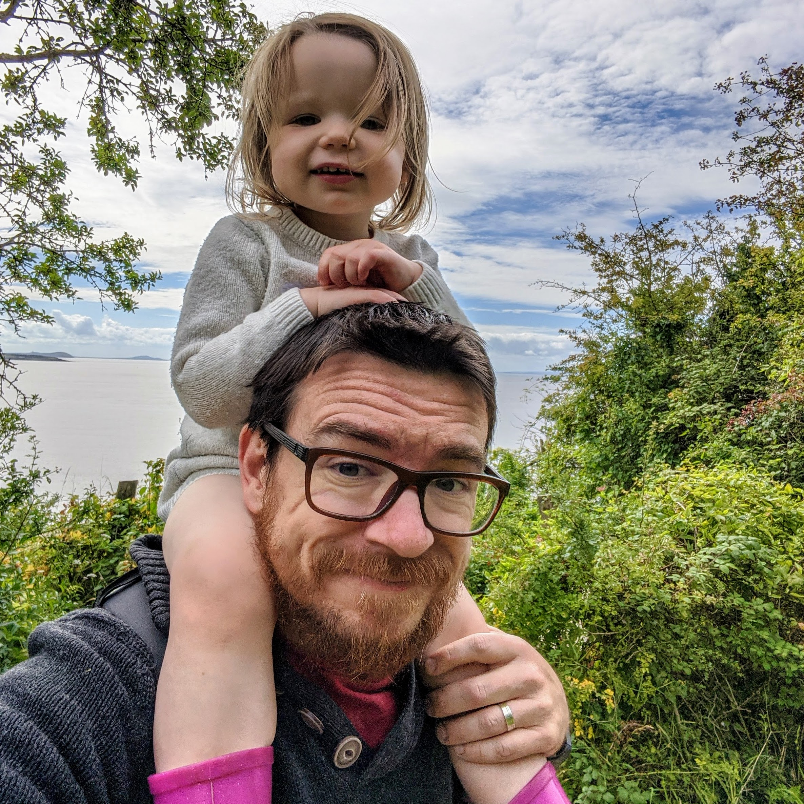

### Hi there 👋

I am Dr Martin Chorley.

I'm a Reader at the [School of Computer Science &amp; Informatics](http://www.cardiff.ac.uk/computer-science/), Cardiff University. I am the Director of Learning and Teaching for the school, which means I look after our Undergraduate and Taught Postgraduate programmes and students.

I’m programme leader for the [MSc in Computational and Data Journalism](http://www.cardiff.ac.uk/study/postgraduate/taught/courses/course/computational-and-data-journalism-msc), our innovative joint-honours degree with the [School of Journalism, Media and Culture (JOMEC)](http://www.cardiff.ac.uk/journalism-media-and-culture). I helped design the course with colleagues from JOMEC and teach on many of the modules.

I'm co-organiser of the [European Data and Computational Journalism Conference](http://datajconf.com/), the third edition of which was held in Malaga in 2019. I helped run the [PyDiff](http://www.pydiff.wales/) meetups here in Cardiff, and attempt to improve student and staff involvement in the local tech scene. I'm also co-founder of the [South Wales x South West](https://twitter.com/hh_swxsw) chapter of [Hacks/Hackers](https://hackshackers.com/), we hold [meetups](https://www.meetup.com/Hacks-Hackers-South-Wales-x-South-West/) in Cardiff and Bristol bringing together journalists and technologists to rethink the future of news and information. 

I write a lot of Python and JavaScript, some of which I put here. 

<!--
**martinjc/martinjc** is a ✨ _special_ ✨ repository because its `README.md` (this file) appears on your GitHub profile.

Here are some ideas to get you started:

- 🔭 I’m currently working on ...
- 🌱 I’m currently learning ...
- 👯 I’m looking to collaborate on ...
- 🤔 I’m looking for help with ...
- 💬 Ask me about ...
- 📫 How to reach me: ...
- 😄 Pronouns: ...
- ⚡ Fun fact: ...
-->
